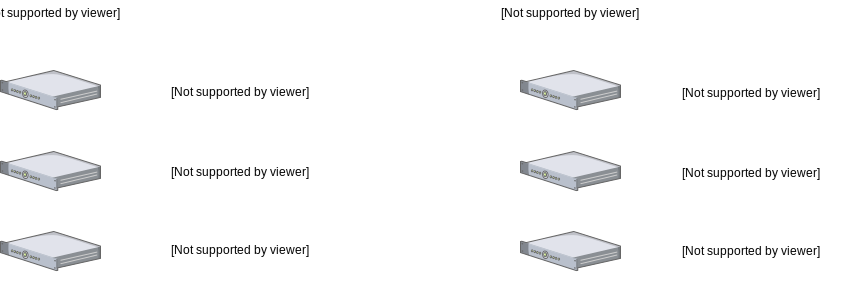

ifndef::imagesdir[:imagesdir: images]
ifndef::sourcedir[:sourcedir: ../../main]
=  EGCP DCS - Digital card system
:doctype: book
:encoding: utf-8
:lang: hr
:toc: left
:toc-title: Sadržaj
:sectnums:
:imagesdir: ./images

VERZIJE

[width="80%",cols="2,^3,<15,10",options="header", align="center"]
|=========================================================
|Verzija |Datum |Opis |Autor(i)
|0.0.1 | 02.05.2017. | Inicijalna Verzija | Tihomir Smuđ, Denis Jajčević
|=========================================================

==  Arhitektura

[.thumb]
.Kontekstni dijagram kao prijedlog idejnog rješenja
image::architecture.svg[scaledwidth=75%,align="center"]

[.thumb]
.Dijagram mrežnih resursa


== Hardwareski preduvjeti

=== JENKINS

[width="80%",cols="2,10,<10,10",options="header", align="center"]
|=========================================================
|Konfiguracija |JVM |RAM |HDD
|Minimalno | Java 7 | 256 MB | 1GB+
|Preporučeno | Java 8 | 1GB+ | 50GB+
|=========================================================

=== NEXUS
[width="80%",cols="2,10,<10,10",options="header", align="center"]
|=========================================================
|Konfiguracija |JVM |RAM |HDD
|Minimalno | Java 7u2 | 256 MB | 1GB+
|Preporučeno | latest | 1GB+ | 50GB+
|=========================================================

=== OPENSHIFT

Preduvjeti ovise o tipu hosta

[width="90%",cols="10,10,<10,10",options="header", align="center"]
|=========================================================
|Tip | CPU | RAM minimum | HDD minimum
|Master | 2 vCPU | 8 GB | 30 GB
|Node | 1 vCPU | 8 GB | 15 GB
|=========================================================

Zajednički preduvjeti: +
Fizički/virtualni sutav ili instanca public/private IaaS. +
Operativni sustav: Red Hat Enterprise Linux (RHEL) 7.1 sa "Minimalnom" instalacijskim opcijama +

Docker 1.6.2+ +
Dodatnih 15 GB nealociranog prostora za konfiguraciju docker storage-a. +

== Hardware - izvedeno

[.thumb]
.Hardwareski resursi



== Instalacija

=== Zajednički preduvjeti

==== Update CentOS

```sh
sudo yum install epel-release
sudo yum update -y
sudo reboot
```

==== Instalirana Java 8 i podešene putanje

```sh
sudo yum install java-1.8.0-openjdk.x86_64
sudo cp /etc/profile /etc/profile_backup
echo 'export JAVA_HOME=/usr/lib/jvm/jre-1.8.0-openjdk' | sudo tee -a /etc/profile
echo 'export JRE_HOME=/usr/lib/jvm/jre' | sudo tee -a /etc/profile
source /etc/profile
```

==== Testiranje uspješne instalacije:

. `java -version`
. `echo $JAVA_HOME`
. `echo $JRE_HOME`

==== SSL terminacija i ispravno podešeni certifikati

1. Request na nekom serveru na kojem je potreban certifikat:

* `openssl req -config /etc/pki/tls/openssl.cnf -key /etc/pki/tls/private/registry.mbu.local.key -new -sha256 -out /etc/pki/tls/certs/registry.mbu.local.csr`

2. Copy & paste CSR-a na CA server

3. Potpisivanje certifikata na CA serveru:

* `openssl ca -config /etc/pki/tls/openssl.cnf -extensions policy_optional -days 65000 -notext -md sha256 -cert /etc/origin/master/ca.crt -keyfile /etc/origin/master/ca.key
-in /etc/pki/tls/certs/registry.mbu.local.csr -out /etc/pki/tls/certs/registry.mbu.local.crt –verbose`

4. Copy & paste potpisanog CRT-a na server na koji instaliramo certikfat

WARNING: Koristiti OpenShift-ov CA (neće raditi s drugim certifikatima).
Obavezno provjeriti `/etc/pki/tls/openssl.cnf` i pripadajući _policy_, te _alternate names_ (wildcard mora bit podržan)

./etc/pki/tls/openssl.cnf
```sh
[ policy_match ]
#countryName            = match
#stateOrProvinceName    = match
#organizationName       = match
countryName             = optional
stateOrProvinceName     = optional
organizationName        = optional
organizationalUnitName  = optional
commonName              = supplied
emailAddress            = optional


####################################################################

[ alternate_names ]

DNS.1       = *.mbu.local
DNS.2       = mbu.local
DNS.3       = egcp.com
```


=== JENKINS

```sh
# Download i install Jenkinsa
sudo wget -O /etc/yum.repos.d/jenkins.repo http://pkg.jenkins-ci.org/redhat-stable/jenkins.repo
sudo rpm --import http://pkg.jenkins-ci.org/redhat-stable/jenkins-ci.org.key
sudo yum install jenkins

# Instaliranje Jenkins servisa
sudo systemctl start jenkins.service
sudo systemctl enable jenkins.service

# Ako je potrebno propustanje porta na kojem se Jenkins vrti: 8080
sudo firewall-cmd --zone=public --permanent --add-port=8080/tcp
sudo firewall-cmd --reload
```

=== NEXUS

```sh
# Download Nexus-a
sudo wget https://sonatype-download.global.ssl.fastly.net/nexus/3/nexus-3.3.0-01-unix.tar.gz
sudo tar -xvf nexus-3.3.0-01-unix.tar.gz

sudo adduser nexus <1>
sudo chown -R nexus:nexus /app/nexus <2>

vi /opt/nexus/bin/nexus.rc <3>

#Instaliranje Nexus servisa
sudo ln -s /opt/nexus/bin/nexus /etc/init.d/nexus
sudo chkconfig --add nexus
sudo chkconfig --levels 345 nexus on
```
<1> Dodati usera
<2> Dati prava nexus useru
<3> Odkomentirati liniju `run_as_user="nexus"`

=== OPENSHIFT

==== Preduvjeti:

. Dodavanje repozitorija `centos-release-openshift-origin`
. Instalacija paketa:
.. `openshift-ansible`
.. `docker`
.. `net-tools`
.. `bind-utils`
.. `iptables-services` (ako je Centos7)
.. `bridge-utils`
.. `origin-client` (na "BPXCO11" server + Jenkins i Nexus repo OSS)
. Omogućiti serveru na kojem se pokreće instalacija _passwordless login_ na ostale servere.
. Dodavanje hostova (masters, nodes, lb, etcd) i ostalih opcija, a ima ih dosta u datoteci `/etc/ansible/hosts`
. Kad je sve spremno pokreće se instalacija naredbom:
.. `ansible-playbook -vvv -i /etc/ansible/hosts /usr/share/ansible/openshift-ansible/playbooks/byo/config.yml > os-install.log`
.. logovi se mogu pratiti tailanjem datoteke `os-install.log`
. Sve ostale feature navedene u host fajli će OS sam skinuti i instalirati tjekom instalacije

NOTE: TODO - popunit s /etc/ansible/hosts datotekom

== Konfiguracija

=== JENKINS

==== Konzola

Jenkins konzola dostupna je na linku: http://bpxco11.mbu.local:8081/

Stndardna _admin_ lozinka promijenjena je u u: `admin` p: `asdf1234`

[.thumb]
.Jenkins login ekran
image::Jenkins-login.jpg[scaledwidth=50%,align="center"]

Nakon logina prikazati će se Jenkinsov dashboard sa svim jobovima. Zbog preglednosti jobovi su podijeljeni po tabovima.

[.thumb]
.Jenkins pregled jobova
image::Jenkins-home.jpg[scaledwidth=75%,align="center"]

Na prvom build tabu su jobovi koji su pipelineovi koji Jenkinsfile skriptu uzimaju iz SCM-a.

[.thumb]
.Jenkins _Builds_ tab
image::Jenkins-build.jpg[scaledwidth=75%,align="center"]

Ostali tabovi sadrže jobove koji su Openshift plugin jobovi konfigurirani da rade deploy pojedinih aplikacija.

[.thumb]
.Jenkins _Deployment Authority DEV-FAT_ tab
image::Jenkins-deploy-auth-dev-fat.jpg[scaledwidth=75%,align="center"]

[.thumb]
.Jenkins _Deployments DEV_ tab
image::Jenkins-deploy-dev.jpg[scaledwidth=75%,align="center"]

[.thumb]
.Jenkins _Deployments FAT_ tab
image::Jenkins-deploy-fat.jpg[scaledwidth=75%,align="center"]

[.thumb]
.Pregled Jenkinsovih security credentialsa
image::Jenkins-credentials.jpg[scaledwidth=75%,align="center"]

[.thumb]
.Credential koji se koristi u svim build jobovima za izradu snapshota
image::Jenkins-credentials-dplesa.jpg[scaledwidth=75%,align="center"]

Pregled build joba `authority` s prikazom uspješnosti izvođenja pojedinih stageova definiranih u Jenkinsfile-u u rootu pojedinog projekta.

[.thumb]
.Jenkins `authority-snapshot` job
image::Jenkins-build-authority.jpg[scaledwidth=75%,align="center"]

==== Instaliranje potrebnih pluginova

[.thumb]
.Jenkins pluginovi
image::Jenkins-plugins.jpg[scaledwidth=75%,align="center"]


Kako bi se _OpenShift Client Plugin_ mogao koristiti potrebno ga je konfigurirati na Jenkinsu.

U glavnom izborniku odabrati: Jenkins -> Manage Jenkins -> Configure System

Credentials se ostavlja prazan jer će se za svaku aplikaciju koristiti drugi `deployer` credentials koji se definira u postavkama openshift plugina pojedinog joba.

WARNING: Kod trenutno korištenog plugina za Openshift postoji bug da se ne prikazuju vrijednosti polja +
         Command to pass into the 2oc" binary i Arguments associated with the above command +
         tako da ako se nešto mijenja na ovom jobu treba svaki put iznova unijeti vrijednosti:

[.thumb]
.Jenkins OpenShift Client Plugin konfiguracija
image::Jenkins-configure-openshift.jpg[scaledwidth=75%,align="center"]

Docker Plugin se koristi samo u testiranju pusha docker imagea na nexus repozitorij.

[.thumb]
.Jenkins konfiguracija _Docker Plugin_-a
image::Jenkins-configure-docker.jpg[scaledwidth=75%,align="center"]

==== Kreiranje jobova

===== Build

Pri kreiranju novog builda potrebno je upisati podatke kao na slici te ovisno o projektu: ::

* `https://devbuild.mbu.local:9443/svn/java/Microservices/ms-authority/trunk`
* `https://devbuild.mbu.local:9443/svn/java/Microservices/ms-b24connector/trunk`
* `https://devbuild.mbu.local:9443/svn/java/Microservices/DCS/dcard/trunk`
* `https://devbuild.mbu.local:9443/svn/java/Microservices/DCS/dsip/trunk`
* `https://devbuild.mbu.local:9443/svn/java/Microservices/DCS/fcard/trunk`


[.thumb]
.Jenkins - kreiranje novog *joba*
image::Jenkins-build-authority-configuration.jpg[scaledwidth=75%,align="center"]

===== Deploy

Za deploy jobove koristimo _OpenShift Client Plugin_ zbog jednostavnosti

NOTE: Kod trenutno korištenog plugina za Openshift postoji bug da se ne prikazuju vrijednosti polja
_"Command to pass into the 'oc' binary"_ i _"Arguments associated with the above command"_.
Ako se nešto mijenja na ovom jobu treba svaki put iznova unijeti vrijednosti: Command: . `import-image` Arguments: . `registry.mbu.local/${ime_projekta}`

[.thumb]
.Jenkins Deploy Authority
image::Jenkins-deploy-authority.jpg[scaledwidth=75%,align="center"]

[.thumb]
.Jenkins Deploy dcs dev
image::Jenkins-deploy-dcs-dev.jpg[scaledwidth=75%,align="center"]

[.thumb]
.Jenkins Deploy dcs
image::Jenkins-deploy-dcs.jpg[scaledwidth=75%,align="center"]

=== NEXUS

Nexus konzola dostupna je na linku: http://bpxco11.mbu.local:8081/

[.thumb]
.Nexus setup
image::nexus-setup.jpg[scaledwidth=75%,align="center"]

Predefinirana standardna admin lozinka je u: `admin` p: `admin123`.

Nakon što se ulogiramo, promjenimo te vrijednosti u admin sekciji nexusa u gornjem desnom kutu.

Inicijalna admin user lozinka promijenjena u u: `admin` p: `asdf1234`

==== Docker repo

U sekciji administracije i konfiguriranja nexus repozitorija prvo kreiramo blob store koji predstavlja fizičku lokaciju gdje će biti smješteni docker imagei.

[.thumb]
image::nexus-repo-admin.jpg[scaledwidth=75%,align="center"]

Klikne se na: Create blob store i popune podaci kao što je prikazano na slici:

[.thumb]
image::nexus-create-blob.jpg[scaledwidth=75%,align="center"]

Zatim se vrati u sekciju administracije i konfuguriranja nexus repozitorija i klikne na: Repositories -> Create repository

Na prvom ekranu između tri ponuđena docker recipea odabere se Hosted +

[.thumb]
image::nexus-create-repo-select-recipe.jpg[scaledwidth=75%,align="center"]

Na sljedećem ekranu se upišu podaci:

Name: osvg-docker
HTTP conector at specified port: 8082 (registry.mbu.local dns zapis gledat će na taj port ovoga repozitorija: bpxco11.mbu.local:8082) +
te se izabere osvg-docker blob store

[.thumb]
image::nexus-create-repo-data.jpg[scaledwidth=75%,align="center"]

Nakon kreiranja repozitorija na pregledu istih imamo copy button koji nam daje URL do novokreiranog repozitorija: http://bpxco11.mbu.local:8081/repoository/osvg-docker/

[.thumb]
image::nexus-create-repo.jpg[scaledwidth=75%,align="center"]


=== OPENSHIFT

Openshit konzola dostupna je na linku:  https://bdxlb12.mbu.local:8443/console/

Predefinirana standardna admin lozinka je u: `osadmin` p: `asdf1234`

[.thumb]
image::openshift-console.jpg[scaledwidth=75%,align="center"]

Nakon logina prikažu se sve svi dostupni projekti

[.thumb]
image::openshift-home.jpg[scaledwidth=75%,align="center"]

Kada se odabere projekt prikaže se overview projekta sa svim relevantnim podacima za taj projekt

[.thumb]
image::openshift-authority-overview.jpg[scaledwidth=75%,align="center"]


[.thumb]
image::openshift-authority-applications-deployments.jpg[scaledwidth=75%,align="center"]

[.thumb]
image::openshift-authority-applications-pods.jpg[scaledwidth=75%,align="center"]

[.thumb]
image::openshift-authority-applications-pods-authorityPod.jpg[scaledwidth=75%,align="center"]

[.thumb]
image::openshift-authority-applications-pods-authorityDBPod.jpg[scaledwidth=75%,align="center"]

[.thumb]
image::openshift-authority-applications-services.jpg[scaledwidth=75%,align="center"]

[.thumb]
image::openshift-authority-applications-services-authority.jpg[scaledwidth=75%,align="center"]

[.thumb]
image::openshift-authority-applications-services-authority-edit-yaml.jpg[scaledwidth=75%,align="center"]

[.thumb]
image::openshift-authority-applications-routes.jpg[scaledwidth=75%,align="center"]

[.thumb]
image::openshift-authority-applications-routes-authority.jpg[scaledwidth=75%,align="center"]

[.thumb]
image::openshift-authority-applications-routes-authority-edit.jpg[scaledwidth=75%,align="center"]

[.thumb]
image::openshift-authority-applications-routes-authority-edit-yaml.jpg[scaledwidth=75%,align="center"]

[.thumb]
image::openshift-authority-builds-images.jpg[scaledwidth=75%,align="center"]

[.thumb]
image::openshift-authority-builds-imges-egcpauthority.jpg[scaledwidth=75%,align="center"]

[.thumb]
image::openshift-authority-builds-imges-egcpauthority-latest.jpg[scaledwidth=75%,align="center"]

[.thumb]
image::openshift-authority-resources-membership.jpg[scaledwidth=75%,align="center"]

[.thumb]
image::openshift-authority-resources-membership-serviceaccounts.jpg[scaledwidth=75%,align="center"]

[.thumb]
image::openshift-authority-resources-secrets.jpg[scaledwidth=75%,align="center"]

[.thumb]
image::openshift-authority-resources-secrets-createsecret.jpg[scaledwidth=75%,align="center"]

[.thumb]
image::openshift-authority-resources-secrets-edityaml.jpg[scaledwidth=75%,align="center"]

[.thumb]
image::openshift-authority-storage.jpg[scaledwidth=75%,align="center"]

[.thumb]
image::openshift-authority-storage-create.jpg[scaledwidth=75%,align="center"]

[.thumb]
image::openshift-dcs-overview.jpg[scaledwidth=75%,align="center"]


==== Kreiranje Aplikacija u Openshiftu

Ispod je primjer kreiranja aplikacija putem oc tool-a. Prethodno je potrebno napraviti i `oc login` s `osadmin` userom.

```sh
oc new-project auhority <1>
oc secrets new-dockercfg nexus-registry \
  --docker-server=registry.mbu.local \
  --docker-username=docker \
  --docker-password=asdf1234 \
  --docker-email=linux.support@egcp.com <2>
oc secrets add builder nexus-registry --for=pull <3>
oc secrets add builder nexus-registry <3>
oc secrets add deployer nexus-registry --for=pull <3>
oc secrets add deployer nexus-registry <3>
oc secrets add default nexus-registry --for=pull <3>
oc secrets add default nexus-registry <3>
oadm policy add-role-to-user edit system:serviceaccount:auhority:deployer -n auhority <4>
```
<1> Kreiranje projekta `authority`
<2> Dodavanje _secret-a_ za interni Docker registar
<3> Dopuštanje `builder`, `deployer`, i `default` userima povlačenje Docker image-a
<4> Davanje prava `deployer` useru na OpenShift API za `authority` namespace kako bi isti mogao modificirati (_edit_ pravo)

== ANNEX
=== Lokalno testiranje Openshifta na strani developera

Verzija Openshifta spremna za testiranje koja radi na Vagrantu +
sastoji se od 1 mastera ali dovoljna za testiranje rada Openshifta. +

Skinuti posljednju verziju vagrant bundlea za openshift zvanog minishift +
get minishift from: https://github.com/minishift/minishift/releases +
instal minishift from: https://docs.openshift.org/latest/minishift/getting-started/installing.html#install-prerequisites +

Defaultni windows VM hypervisor, Hyper-V, ne radi ako imate i koristite na windowsima Virtualbox, stoga treba pokretati minishift sa: +
. `minishift start --vm-driver=virtualbox`

Preporuka prvi puta pozvati minishift sa parametrima resursa: 12GB RAM 3 CPUa +
. `minishift start --memory 12048 --cpus 3`

Dakle ako se radi o windows okolini dolazimo do: +
. `minishift start --memory 12048 --cpus 3 --vm-driver virtualbox`

access Openshift: +
Iako nije pisalo u konzoli navodno se prvi puta logira kao u:developer p:developer +
The server is accessible via web console at: +
    https://192.168.99.100:8443 +
To login as administrator: +
    oc login -u system:admin +

Da bi dobili binary u Path izvrsiti komandu: +
. `minishift oc-env`

te izvrsiti komandu koja vam ovisno o OSu ce izgledati otprilike ovako +
. `SET PATH=c:\xMINISHIFT\cache\oc\v1.5.0;%PATH%`

